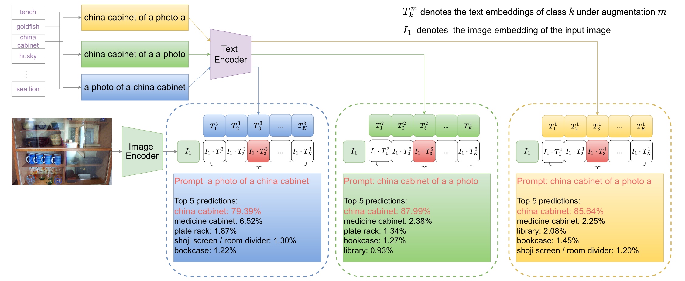

 
#  TAG: Text Prompt Augmentation for Zero-Shot Out-of-Distribution Detection

This is the offical repository for our [TAG](https://drive.google.com/file/d/1kAe3RQdOr-ViR3xwTSccnzxVYvYNUeGv/view?usp=sharing) and the presentation can be found [here](https://youtu.be/LMr6oOOCz9Q?si=MDfUTmqJe_sChNLs).


### Illustration



## Data Preparation

We consider the following (in-distribution) datasets: CIFAR-100, ImageNet-100, and ImageNet-1k. 

**Small-scale OOD datasets** For small-scale ID (e.g. CIFAR-100), we use SVHN, Textures (dtd), Places365, LSUN and iSUN. 

OOD datasets can be downloaded via the following links (source: [ATOM](https://github.com/jfc43/informative-outlier-mining/blob/master/README.md) and [CIDER](https://github.com/deeplearning-wisc/cider?tab=readme-ov-file#how-to-exploit-hyperspherical-embeddings-for-out-of-distribution-detection)):

* [SVHN](http://ufldl.stanford.edu/housenumbers/test_32x32.mat): download it and place it in the folder of `datasets/small_OOD_dataset/svhn`. Then run `python utils/select_svhn_data.py` to generate test subset.
* [Textures](https://www.robots.ox.ac.uk/~vgg/data/dtd/download/dtd-r1.0.1.tar.gz): download it and place it in the folder of `datasets/small_OOD_dataset/dtd`.
* [Places365](http://data.csail.mit.edu/places/places365/test_256.tar): download it and place it in the folder of `datasets/ood_datasets/places365/test_subset`. We randomly sample 10,000 images from the original test dataset. 
* [LSUN-C](https://www.dropbox.com/s/fhtsw1m3qxlwj6h/LSUN.tar.gz): download it and place it in the folder of `datasets/small_OOD_dataset/LSUN`.
* [iSUN](https://www.dropbox.com/s/ssz7qxfqae0cca5/iSUN.tar.gz): download it and place it in the folder of `datasets/small_OOD_dataset/iSUN`.

**Large-scale OOD datasets** For large-scale ID (e.g. ImageNet-100), we use the curated 4 OOD datasets from OpenImage-O, Texture, iNaturalist, and ImageNet-O. (source: [ViM](https://github.com/haoqiwang/vim))
 
- [ImageNet](https://www.image-net.org/). The ILSVRC 2012 dataset as In-distribution (ID) dataset. 
- [ImageNet-100](https://github.com/deeplearning-wisc/MCM).
- [OpenImage-O](https://github.com/openimages/dataset/blob/main/READMEV3.md). The OpenImage-O dataset is a subset of the OpenImage-V3 testing set. The filelist is [here](datalists/openimage_o.txt).  
- [Texture](https://www.robots.ox.ac.uk/~vgg/data/dtd/). We rule out four classes that coincides with ImageNet. The filelist used in the paper is [here](datalists/texture.txt).
- [iNaturalist](https://arxiv.org/pdf/1707.06642.pdf). Follow the instructions in the [link](https://github.com/deeplearning-wisc/large_scale_ood) to prepare the iNaturalist OOD dataset.
- [ImageNet-O](https://github.com/hendrycks/natural-adv-examples). Follow the guide to download the ImageNet-O OOD dataset.


## Evaluation
 
1. extract features
    ```bash
    python eval/extract_features.py  # specify model name ['ViT-B/16', 'ViT-B/32','ViT-L/14', 'RN50', 'RN101']  
    ```
2. evaluation
    ```bash
    python eval/eval_ood_cifar_100.py --model_name  ['ViT-B/16', 'ViT-B/32','ViT-L/14', 'RN50', 'RN101'] --shuffle --M [int_number_of_augmentations] --temp [temperature] --score_name ['MSP', 'Max-Logit','Energy','GEN']
    python eval/eval_ood_imagenet_100.py --model_name  ['ViT-B/16', 'ViT-B/32','ViT-L/14', 'RN50', 'RN101'] --shuffle --M [int_number_of_augmentations] --temp [temperature] --score_name ['MSP', 'Max-Logit','Energy','GEN'] 
    python eval/eval_ood_imagenet_1k.py --model_name  ['ViT-B/16', 'ViT-B/32','ViT-L/14', 'RN50', 'RN101'] --shuffle --M [int_number_of_augmentations] --temp [temperature] --score_name ['MSP', 'Max-Logit','Energy','GEN']  
    ```
3. texture embedding analysis
   ```bash
    python eval/SVD_text_embeddings.py
    ```


## Citation

```
@inproceedings{Liu2024TAG,
title = {TAG: Text Prompt Augmentation for Zero-Shot Out-of-Distribution Detection},
author = {Liu, Xixi and Christopher, Zach},
booktitle = {European Conference on Computer Vision},
year = {2024}
}
```

## Acknowledgement

Our data preparartion code is adapted from [ViM](https://github.com/haoqiwang/vim) and [CIDER](https://github.com/deeplearning-wisc/cider?tab=readme-ov-file#how-to-exploit-hyperspherical-embeddings-for-out-of-distribution-detection) repos, thanks a lot for their great work!
